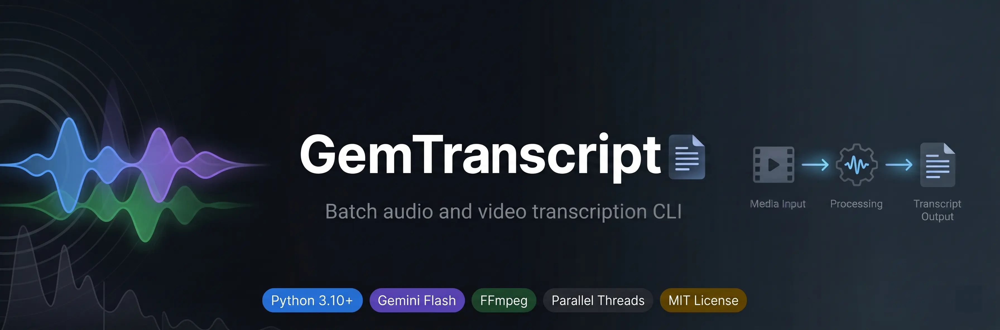

<p align="center">
  
</p>

<h1 align="center">GemTranscript</h1>

<p align="center">
  <a href="https://www.python.org/">
    
  </a>
  <a href="https://pypi.org/project/google-genai/">
    
  </a>
  <a href="https://pypi.org/project/tenacity/">
    
  </a>
  <a href="https://ai.google.dev/">
    
  </a>
  <a href="https://ffmpeg.org/">
    
  </a>
  <a href="LICENSE">
    
  </a>
</p>

<p align="center">
  High-performance CLI for batch transcription of audio and video files using Google Gemini 3.0 Flash, optimized for low bandwidth consumption and deterministic output
</p>

---

## Quick Start

```bash
git clone https://github.com/roymejia2217/GemTranscript.git
cd GemTranscript
python -m venv venv
source venv/bin/activate    # Linux/macOS
# .\venv\Scripts\activate   # Windows
pip install -r requirements.txt
```

Create a `.env` file in the project root:

```env
GEMINI_API_KEY=your_api_key_here
```

```bash
python main.py
```

---

## Features

| Feature | Description |
|---------|-------------|
| **Gemini 3.0 Flash Engine** | Leverages the 1M-token context window to process files up to 8 hours in a single pass |
| **Bandwidth Optimization** | Extracts audio from video to mono MP3 at 32kbps before upload, reducing transfer size by approximately 95% |
| **Multi-Format Support** | Handles MP4, MOV, MKV, MP3, WAV, M4A, FLAC, OGG, AVI, WEBM, FLV, and 3GP transparently |
| **Parallel Processing** | Configurable thread pool (default 3 workers) for concurrent file transcription |
| **Idempotent Execution** | Skips files that already have a corresponding transcription output, enabling safe re-runs |
| **Unicode Filename Handling** | Sanitizes file paths and uses hardlinks or copies to work around non-ASCII restrictions in the Google API |
| **Deterministic Output** | Temperature set to 0 ensures verbatim transcription without hallucinations or conversational metadata |
| **Automatic Cleanup** | Removes temporary local files and remote uploads from the Google File API after each transcription |
| **Retry with Backoff** | Exponential backoff for transient API failures, with configurable retry count and wait limits |

---

## Prerequisites

| Dependency | Purpose | Installation |
|------------|---------|--------------|
| **Python** 3.10+ | Runtime environment | [python.org](https://www.python.org/) |
| **FFmpeg** | Audio extraction and media duration detection | `sudo apt install ffmpeg` (Linux), `brew install ffmpeg` (macOS), [ffmpeg.org](https://ffmpeg.org/) (Windows) |
| **FFprobe** | Media metadata retrieval | Included with FFmpeg |
| **Google Gemini API Key** | Authentication for the Gemini API | [aistudio.google.com](https://aistudio.google.com/) |

---

## Usage

1. Place audio or video files in the `files/` directory.
2. Run the application:

```bash
python main.py
```

3. Transcriptions are saved as `.txt` files in the `output/` directory, named `{original_name}_transcription.txt`.

Files that already have a corresponding transcription are skipped automatically.

---

## Project Structure

```
config/
└── settings.py             # Global configuration (model, paths, limits, concurrency)
src/
├── gemini_client.py        # Gemini API client (upload, poll, transcribe, delete, retry)
├── media_processor.py      # FFmpeg operations, media detection, segment calculation
├── transcriber.py          # Orchestrator (batch processing, thread pool, idempotency)
└── utils.py                # Filename sanitization for API compatibility
main.py                     # Entry point (config validation, logging, execution)
requirements.txt            # Python dependencies
```

Runtime directories (created automatically):

```
files/          # Input media files
output/         # Transcription output (.txt)
logs/           # Execution logs and temporary audio extractions
temp_uploads/   # Temporary hardlinks for Unicode filename workaround
```

---

## License

MIT License. See [LICENSE](LICENSE) for details.